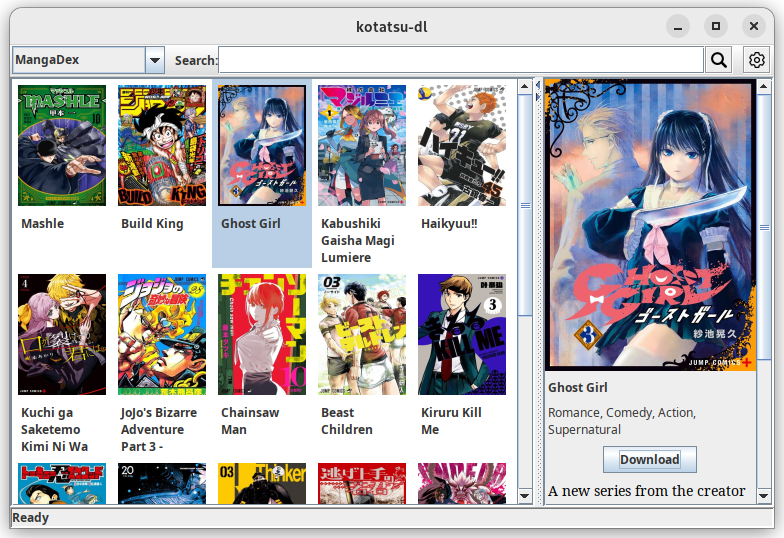

# Kotatsu-dl

Cross-platform desktop application to download manga from various services

[](https://aur.archlinux.org/packages/kotatsu-dl-git) [](https://github.com/nv95/kotatsu-dl/blob/master/LICENSE) [](https://discord.gg/NNJ5RgVBC5)



### Installation

#### Arch linux

Package `kotatsu-dl-git` is available on AUR:

```shell
yay -S kotatsu-dl-git
```

#### Windows or other Linux distro

Just download an appropriate archive from the [latest release](https://github.com/nv95/kotatsu-dl/releases/latest).  

### License
[](http://www.gnu.org/licenses/gpl-3.0.en.html)

Kotatsu is Free Software: You can use, study share and improve it at your
will. Specifically you can redistribute and/or modify it under the terms of the
[GNU General Public License](https://www.gnu.org/licenses/gpl.html) as
published by the Free Software Foundation, either version 3 of the License, or
(at your option) any later version.

### Disclaimer

The developers of this application does not have any affiliation with the content providers available.